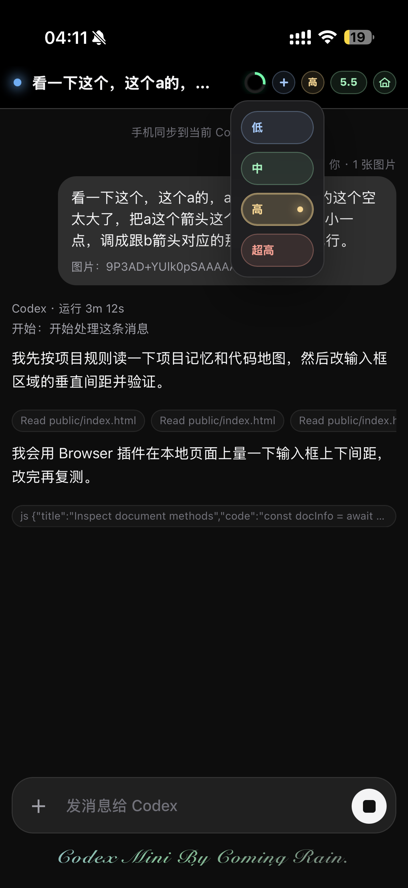
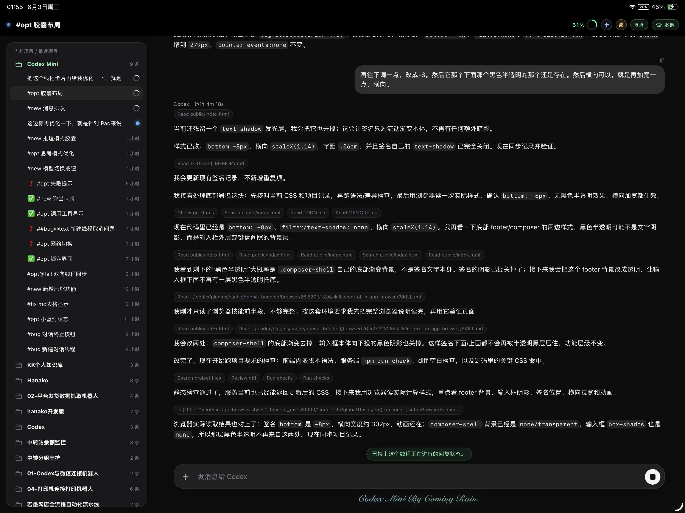
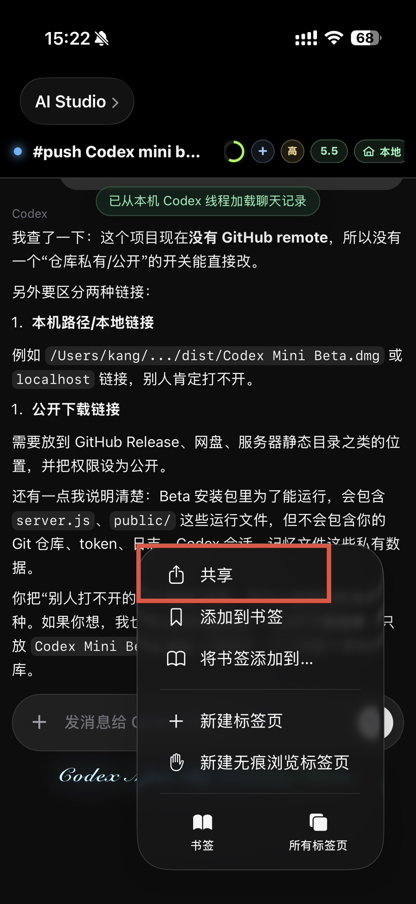
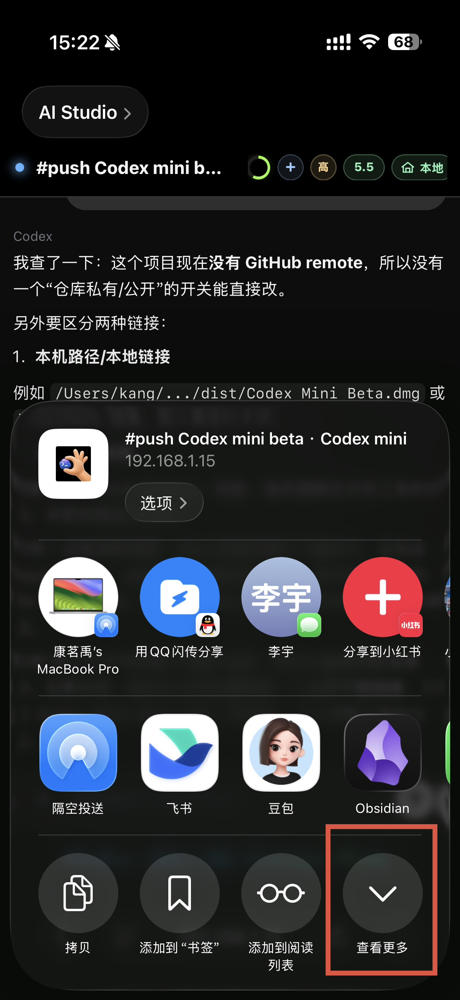
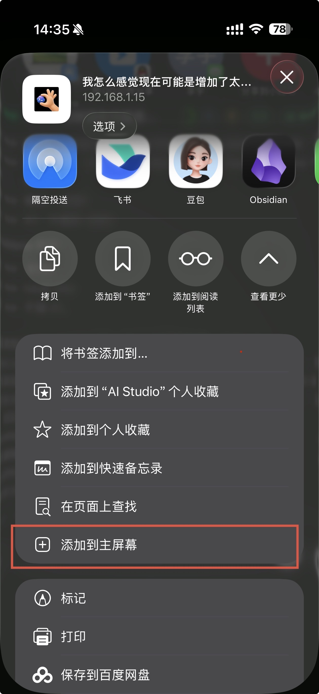

# Codex Mini

Codex Mini 是一个把手机浏览器连接到 Mac 上 Codex Desktop 的轻量桥接工具。你可以在手机上打开一个本地网页，把文字或图片发送到 Mac 上正在使用的 Codex 对话中，并在网页里同步查看 Codex 的回复过程和结果。

> 📌 **开源版 / 构建版说明**
>
> 本仓库提供 Codex Mini 的开源维护版本，适合有服务器或开发能力的朋友自行部署、改造和二次开发。由于我个人精力有限，也希望通过开源让更多人一起参与改进。
>
> 目前官方构建版仅支持 **macOS**。如果你需要 Windows 版本，可以关注社区是否有基于本项目开发的实现或分支，也欢迎有能力的朋友一起探索 Windows 版本等更多形态。
>
> 如果你不想折腾部署，或者没有自己的服务器，可以直接下载我构建好的 **DMG 应用** 使用。DMG 构建版会持续维护，并优先提供最新功能；部分新功能可能不会第一时间同步到开源版，开源版会保持可用和维护，但节奏可能略滞后。感谢大家的支持，我也会在能力范围内持续把 Codex Mini 优化好。

## 开源版与构建版

上面的提示是当前项目的版本定位：开源版方便自部署和二次开发，DMG 构建版适合直接安装使用并优先体验最新功能。

## 当前发布版本

- 版本：Codex Mini Beta v3.0.5
- 安装包：[直接下载 Codex Mini Beta v3.0.5.dmg](https://github.com/CoimgRain/Codex-Mini/releases/download/codex-mini-beta-v3.0.5/Codex.Mini.Beta.v3.0.5.dmg)
- Release 页面：[codex-mini-beta-v3.0.5](https://github.com/CoimgRain/Codex-Mini/releases/tag/codex-mini-beta-v3.0.5)
- 适用设备：Apple Silicon Mac
- 本地局域网功能：免费使用
- Pro 会员：支持服务器中转外网入口，离开同一个 Wi-Fi / 局域网后也可以远程操控自己的 Mac 上的 Codex

### V3.0.5 重点更新

- 修复 **App 内更新安装失败**：新版 DMG 改为直接包含 App，不再走 pkg 安装器。
- 优化 **手动安装体验**：打开 DMG 后直接把 `Codex Mini Beta.app` 拖到 Applications 即可。
- 保留 v3.0.4 的 App 内检查更新入口，以及远程连接、Pro 激活和 Safari 稳定性优化。

## 界面预览

  
  
  

  

## 加入交流群

QQ 群：**760669553**

欢迎加入群里交流使用问题、反馈 bug、提出功能建议。后续有最新版本也会在群里及时沟通。

## 安装与使用

1. 在 Releases 页面下载带版本号的 `Codex.Mini.Beta.v3.0.5.dmg`
2. 打开 DMG，把里面的 `Codex Mini Beta.app` 拖到 `Applications` 文件夹
3. 打开 `/Applications/Codex Mini Beta.app`
4. 本地局域网功能免费可用：在同一个 Wi‑Fi 下，复制 App 里的局域网入口到手机浏览器打开即可使用
5. 如果需要离开同一个 Wi‑Fi 后继续使用，在 App 的 Pro 会员区域开启 7 天试用或购买月度/季度/年度计划
6. Pro 激活成功后，请重新复制 App 里的 **外网入口** 到手机上使用；之后手机不在同一个局域网时，也可以通过服务器中转连接自己的 Mac
7. 一定要把网页添加到手机主屏幕，作为 App 打开使用；这样才是完整体验。只在普通浏览器标签页里使用，会受到浏览器界面、键盘和系统限制影响。

## 添加到主屏幕

iPhone 上打开 Codex Mini Beta 网页后，按下面三步操作：

1. 点浏览器底部或菜单里的“分享”
2. 如果没看到“添加到主屏幕”，先点“查看更多”
3. 点“添加到主屏幕”，之后从桌面图标打开 Codex Mini Beta

> 第一次使用时，Mac 可能需要给 Codex Desktop 或 Codex Mini 相关自动化操作授予辅助功能/自动化权限，否则无法把手机输入粘贴并发送到 Codex Desktop。

  
  
  

## 当前版本实现原理

Codex Mini Beta 是一个手机到 Mac 上 Codex Desktop 的轻量桥接工具，核心流程大致如下：

1. Mac 上运行一个本地服务，默认由 `Codex Mini Beta.app` 管理
2. 手机网页把文字或图片发送到这台 Mac
3. 本地服务读取 Codex Desktop 的会话状态，并通过 macOS 自动化把内容粘贴到当前 Codex 线程里
4. 本地服务继续读取 Codex 会话日志，把可见回复、运行状态、工具调用过程等同步回手机网页
5. 在同一个 Wi‑Fi 下，手机优先直连局域网入口，速度更快
6. 开启 Pro 后，手机也可以走服务器中转入口；当你在外面、不在同一个局域网时，仍然可以连接自己的 Mac 并远程操控 Codex

也就是说，Codex Mini Beta 本身不是云端聊天服务。服务器中转只负责把手机请求转回你自己的 Mac，真正的 Codex 登录状态、线程切换、输入和回复读取仍然发生在你的 Mac 上。

## 本地免费与 Pro 会员

- 本地局域网功能永久免费：手机和 Mac 在同一个 Wi‑Fi / 局域网下即可使用
- Pro 会员解锁外网入口：通过服务器中转连接自己的 Mac，不在同一个 Wi‑Fi 下也可以使用
- 当前支持 7 天免费试用、月度、季度和年度计划
- Pro 激活后请重新复制新的外网入口到手机上；旧的局域网入口只适合同一网络下使用

## 服务器中转与隐私

- 服务器中转只做连接转发，不代替你的 Codex 账号，也不保存聊天正文或图片内容
- 请不要把自己的访问链接、令牌或电脑隐私信息发给陌生人
- 为了保持服务稳定，图片大小、图片频率和套餐流量会有合理限制

## 注意事项

- 请确保 Mac 上已经安装并登录 Codex Desktop
- 请保持 Codex Desktop 可正常使用
- 请不要把自己的访问链接、令牌或电脑隐私信息发给陌生人
- 当前是 Beta 版本，可能存在兼容性问题，欢迎进群反馈

## 源码说明

本仓库提供 Codex Mini 的开源维护版本，适合希望自行部署、接入自己的服务器或进行二次开发的用户。

如果你更希望开箱即用，或者想优先体验最新功能，建议直接下载 Releases 中的 DMG 构建版。构建版会持续维护，部分新功能可能会先在构建版中发布，再逐步同步到开源版本。
